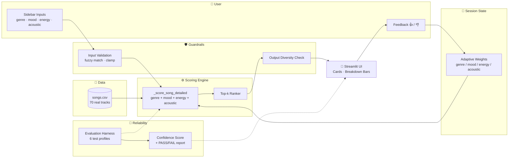
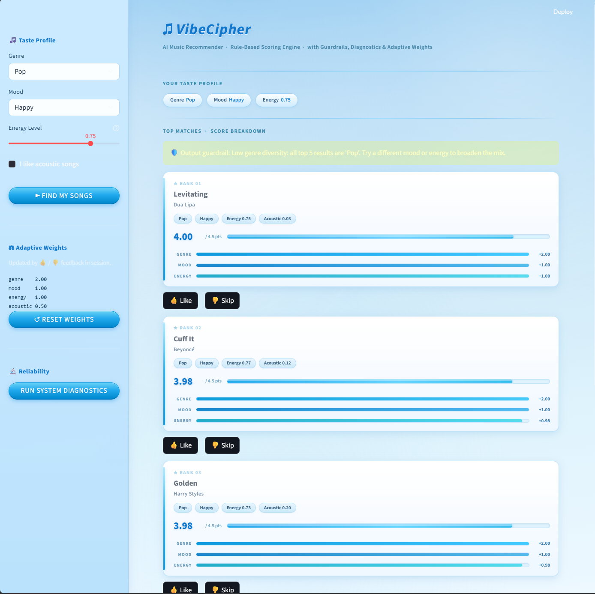
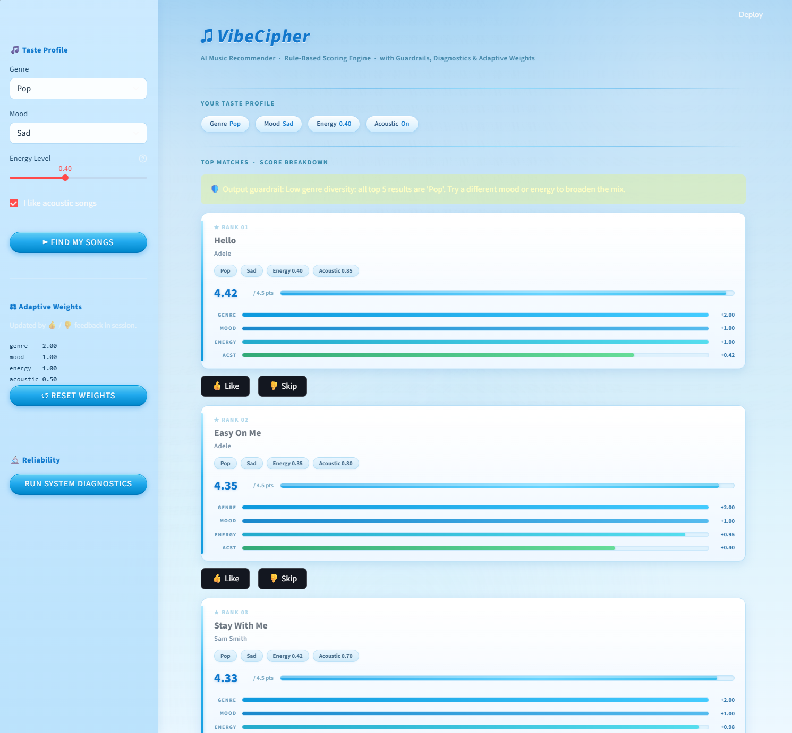

# 🎵 VibeCipher: Applied AI Music Recommender

> A rule-based music recommender that explains its decisions, tests its own behavior, and lets users tweak how it works in real time.


VibeCipher takes four inputs from the user: favorite genre, preferred mood, target energy level, and whether they like acoustic songs. It then scores all 70 songs in its catalog and returns the top 5 matches.

What makes this project different is that it doesn’t just give results, it shows exactly *why* each song was chosen using a clear score breakdown. I also added testing, guardrails, and a simple feedback loop so the system feels more interactive and reliable.

---

## 1. Base Project

This project builds on the **CodePath AI110 Module 3 Music Recommender Simulation**.

The starter project already had:

* basic classes (`Song`, `UserProfile`, `Recommender`)
* a simple scoring system (genre + mood + energy)

From there, I extended it by adding:

* a **70-song dataset with real artists**
* **acoustic preference** (this was originally collected but not used)
* a **score breakdown system** for transparency
* a **Streamlit UI** with custom styling
* **input and output guardrails**
* a small **evaluation system** to test behavior
* a simple **feedback loop** to adjust weights during a session

---

## 2. System Overview

The main question this system answers is:

**“Given my preferences, which songs best match and why?”**

Instead of using machine learning, I kept the system **rule-based on purpose**. That way, every recommendation can be explained clearly.

Each song gets a score based on four components:

* genre match
* mood match
* energy similarity
* acoustic preference (optional)

The goal here wasn’t to make the smartest recommender possible, but to make one that is **easy to understand, test, and demonstrate**.

---

## 3. Architecture



### How data flows (in simple terms)

* User enters preferences in the sidebar
* Inputs are cleaned (guardrails)
* Each song is scored
* Songs are sorted
* Top 5 are displayed
* UI shows breakdown + explanations
* Feedback buttons adjust weights for the session

---

## 4. AI Features

### 4.1 Scoring Engine

Each song is scored using:

| Component | Weight  | Description                   |
| --------- | ------- | ----------------------------- |
| Genre     | +2.0    | Exact match                   |
| Mood      | +1.0    | Exact match                   |
| Energy    | 0.0–1.0 | Based on distance from target |
| Acoustic  | 0.0–0.5 | Only if enabled               |

**Max score = 4.5**

One thing I fixed here:
The original project collected acoustic preference but didn’t use it. I added that into the scoring so it actually affects results.

---

### 4.2 Evaluation System

I added a small test system to check if the recommender behaves correctly.

Examples:

* Pop users should get Pop songs at the top
* High-energy requests should return high-energy songs
* Same input should always give the same output

Run it with:

```bash
python -m src.evaluator
```

You can also trigger it from the UI.

---

### 4.3 Guardrails

To make the system more robust:

**Input checks:**

* Fix typos using fuzzy matching
* Clamp energy values
* Ensure valid inputs

**Output check:**

* Warn if all results are too similar (low diversity)

---

### 4.4 Feedback Loop

Each recommendation has 👍 / 👎 buttons.

When clicked:

* The system slightly adjusts weights (genre, mood, energy, acoustic)
* Changes only apply during the session
* You can reset at any time

This was mainly added to show how a system could adapt to user preferences.

---

## 5. Setup

```bash
git clone https://github.com/R4Y3D/ai110-module3show-musicrecommendersimulation-starter.git
cd ai110-module3show-musicrecommendersimulation-starter

python -m venv .venv
source .venv/bin/activate
pip install -r requirements.txt

streamlit run src/app.py
```

---

## 6. Sample Interactions

### Example 1: Pop / High Energy



**Input:** Pop, Happy, 0.75
**Result:** Top songs all match genre + mood, energy breaks ties

---

### Example 2: Acoustic Listener



**Input:** Pop, Sad, 0.4, Acoustic ON

Here the acoustic bonus becomes important and pushes acoustic songs higher in ranking.

---

## 7. Testing Summary

* Unit tests: **7/7 passed**
* Evaluation system: **6/6 passed**
* UI flows tested manually

---

## 8. Reflection

### Limitations

* Genre and mood require exact matches
* Dataset is still relatively small
* No persistence between sessions
* Weights are manually chosen

### Bias

* Dataset reflects what I included
* Genre weight dominates scoring
* Mood labels are subjective

### What I learned

One thing that stood out while building this is that recommender systems are really just scoring systems. The tricky part isn’t the math: it’s deciding what matters and how much.

Also, writing tests for behavior (not just code) was surprisingly useful. It forced me to define what “good recommendations” actually mean.

---

## 9. Demo

📹 Loom video:
https://www.loom.com/share/79411f886a23430eb1487b6907458a04

---

## 10. Repo Layout

```
src/
  recommender.py
  guardrails.py
  evaluator.py
  app.py
data/
  songs.csv
tests/
  test_recommender.py
```