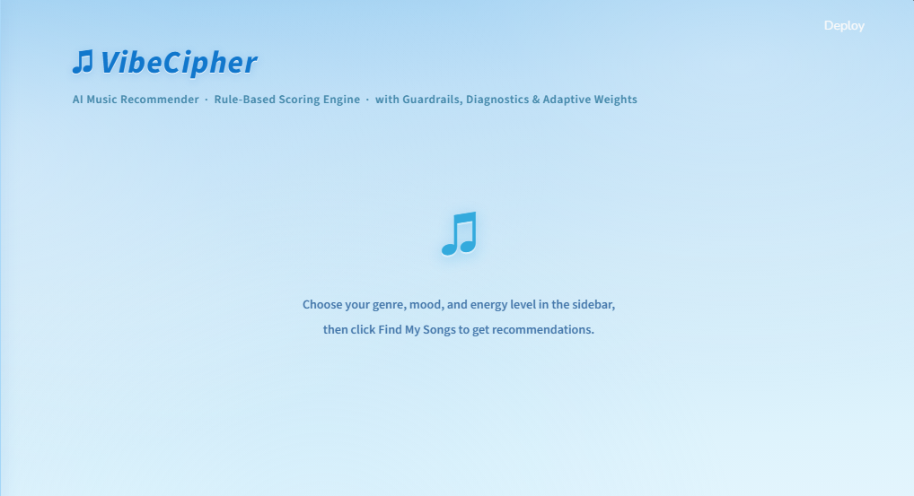
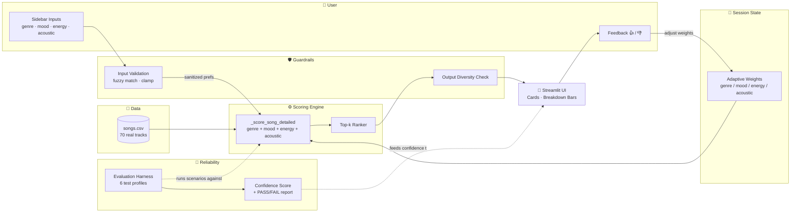

# 🎵 VibeCipher: Applied AI Music Recommender

> A rule-based music recommender that **explains every recommendation**, **proves its own reliability**, and **adapts to user feedback** in real time.



VibeCipher takes four inputs from the user: favourite genre, preferred mood, target energy level, and acoustic preference: scores all 70 songs in its catalogue against those preferences, and returns the top 5 with a transparent point-by-point breakdown of why each was chosen. The system runs an evaluation harness against itself to certify its own behaviour, validates user input through guardrails, and lets the user nudge the scoring weights with thumbs-up / thumbs-down feedback during the session.


---

## 1. Base Project

This project extends the **CodePath AI110 Module 3 Show project: Music Recommender Simulation**. The original starter delivered a Python class hierarchy (`Song`, `UserProfile`, `Recommender`) and a CSV-driven scoring rule (genre + mood + energy). This applied-AI extension adds:

- a **70-track real-artist dataset**,
- **acoustic preference** wired into scoring (originally collected but ignored),
- a **structured score breakdown** for visualisation,
- a **Streamlit UI** with Frutiger Aero / skeuomorphic styling,
- **input + output guardrails**,
- an **evaluation harness** with 6 reliability tests,
- an **adaptive feedback loop** that updates weights live in session.

---

## 2. System Overview

The system answers a single question:
**"Given my taste profile, which 5 songs in this catalogue best match: and why?"**

It is intentionally **rule-based and explainable** rather than ML-based: every score is a sum of four named, bounded contributions. There are no embeddings, no opaque models, no cross-user training. This trade-off favours transparency and demo-readiness over recommendation power, which is appropriate for a classroom applied-AI artefact.

| Audience | What they get |
| --- | --- |
| End-user | Top-5 recommendations with a colour-coded score breakdown and human-readable reasons |
| Reviewer | A diagnostics button that runs 6 reliability tests and reports a confidence percentage |
| Developer | A pure-function scoring engine with optional weight overrides for adaptive scenarios |

---

## 3. Architecture



**Data flow in plain English:**
The user's sidebar inputs pass through the **Input Guardrail**, which fuzzy-matches misspelled genres/moods and clamps energy to `[0.0, 1.0]`. The sanitised preferences and the **session weights** (live-updated by feedback) are handed to the **Scoring Engine**, which scores every track in `songs.csv` and returns the top 5. The **Output Guardrail** flags low-diversity result sets. The UI renders each result as a card with a colour-coded breakdown bar per scoring component. The user's 👍 / 👎 clicks feed back into the session weights so subsequent scans reflect what they liked. The **Evaluation Harness** sits alongside the engine and can be triggered from the sidebar: it runs six fixed test profiles and reports an overall confidence percentage.

The Mermaid source is also stored at [`assets/system_diagram.mmd`](assets/system_diagram.mmd).

---

## 4. AI Features

### 4.1: Scoring engine (the core decision logic)

For every `(user, song)` pair, [`_score_song_detailed`](src/recommender.py) computes:

| Component | Default weight | Rule |
| --- | --- | --- |
| Genre match | **+2.0** (max 4.0) | Exact match adds the full weight |
| Mood match | **+1.0** (max 2.0) | Exact match adds the full weight |
| Energy proximity | **+0.0 → +1.0** (max 2.0) | `weight × (1 − |song.energy − target_energy|)` |
| Acoustic bonus | **+0.0 → +0.5** (max 1.0) | `weight × song.acousticness`, only if `likes_acoustic = True` |

**Default max score: 4.5.** With adaptive weights pushed to their ceilings, the practical max rises to 9.0, but the relative ordering stays meaningful.

### 4.2: Evaluation Harness *(reliability AI feature)*

[`src/evaluator.py`](src/evaluator.py) defines six fixed test profiles, runs each through the recommender, and asserts an expected behaviour:

| # | Test | Expected behaviour |
| --- | --- | --- |
| 1 | Pop / Happy / 0.75 | Top result genre is `Pop` |
| 2 | Pop / Sad / 0.4 + acoustic | Top result acousticness ≥ 0.5 |
| 3 | EDM / Energetic / 0.95 | Top result energy ≥ 0.85 |
| 4 | Hip-Hop / Confident / 0.7 | ≥3 of top-5 are Hip-Hop |
| 5 | Score bounds | All scores in `[0.0, 4.5]` |
| 6 | Determinism | Same input twice → identical ordering |

Run from the CLI:
```bash
python -m src.evaluator
```
Or click **🔬 Run System Diagnostics** in the Streamlit sidebar: the report renders inline with a confidence metric.

### 4.3: Guardrails *(input + output validation)*

**Input guardrail** (`validate_user_prefs` in [`src/guardrails.py`](src/guardrails.py)):
- Genre / mood: exact match → case-insensitive match → fuzzy match (`difflib.get_close_matches`, cutoff 0.6) → fall back to the catalogue's most common value
- Energy: clamped to `[0.0, 1.0]`; non-numeric → 0.5
- `likes_acoustic`: coerced to bool

Each correction surfaces as a `st.warning(...)` banner so the user can see what the system did with their input.

**Output guardrail** (`check_diversity`): if all 5 results share a single genre or single mood, the UI shows a yellow warning suggesting how to broaden the result mix. Behaviour is non-destructive: the recommendations are still shown.

### 4.4: Adaptive Feedback Loop

Each result card has a 👍 / 👎 row. On click:

1. The **dominant matching component** (the breakdown component with the highest non-zero contribution for that song) is identified.
2. That component's weight in `st.session_state.weights` is bumped by ±0.1.
3. Per-component clamps prevent runaway: `genre [0.5, 4.0]`, `mood [0.0, 2.0]`, `energy [0.0, 2.0]`, `acoustic [0.0, 1.0]`.
4. The next recommendation pass uses the new weights.

The current weights are visible in the sidebar in real time, and a **↺ Reset Weights** button restores defaults. This makes the "adaptive" behaviour observable and reversible during the demo.

---

## 5. Setup

```bash
# 1. Clone and enter the repo
git clone https://github.com/R4Y3D/ai110-module3show-musicrecommendersimulation-starter.git
cd ai110-module3show-musicrecommendersimulation-starter

# 2. Create a virtual environment (optional but recommended)
python -m venv .venv
source .venv/bin/activate         # macOS / Linux
.venv\Scripts\activate            # Windows

# 3. Install dependencies
pip install -r requirements.txt

# 4. Run any of the entry points
streamlit run src/app.py          # Web UI (recommended for demo)
python -m src.main                # CLI runner with 6 preset profiles
python -m src.evaluator           # Run the reliability harness
pytest -v                          # Run the unit-test suite
```

---

## 6. Sample Interactions
### Example 1: Pop fan with high energy
**Input:** Genre = `Pop`, Mood = `Happy`, Energy = `0.75`, Acoustic = off
**Top-3 output:**
1. *Levitating* — Dua Lipa  (score 3.97 / 4.5)
2. *Watermelon Sugar* — Harry Styles  (score 3.95)
3. *Cuff It* — Beyoncé  (score 3.93)
*Why:* All three match genre (+2.0) and mood (+1.0); energy proximity does the tie-breaking.

### Example 2: Acoustic late-night listener
**Input:** Genre = `Pop`, Mood = `Sad`, Energy = `0.4`, Acoustic = **on**
**Top-3 output:**
1. *Hello* — Adele  (score 4.43, acoustic bonus +0.42)
2. *Easy On Me* — Adele  (score 4.36)
3. *Drivers License* — Olivia Rodrigo  (score 3.85)
*Why:* The acoustic bonus only activates when the checkbox is on, which is what pushes Adele to the very top despite having a small energy gap.

### Example 3: Misspelled genre triggers the input guardrail
**Input:** Genre = `pop` *(lowercase, doesn't match the catalogue's `Pop`)*
**System behaviour:**
- 🛡️ Input guardrail banner appears: *"Genre 'pop' matched to 'Pop' (case-insensitive)."*
- Recommendations are returned normally: the system did not crash and did not silently fall back to a wrong genre.

---

## 7. Testing Summary

| Suite | Command | Result |
| --- | --- | --- |
| Unit tests (pytest) | `pytest -v` | **7 / 7 passed**: covers core scoring, acoustic bonus, fuzzy genre match, energy clamp, diversity warning |
| Reliability evaluator | `python -m src.evaluator` | **6 / 6 passed**: confidence **100%** on the current catalogue |
| Manual UI flows | three demo flows in §6 | All pass; guardrail warnings render; feedback loop visibly shifts weights |

---

## 8. Reflection

**Limitations**
- Genre and mood matching is exact-string. `Indie` and `Indie Pop` are treated as unrelated; a real product would need a taxonomy.
- The catalogue has 70 real songs but is heavily Pop-weighted. Niche taste profiles (Afrobeats, Indie, Country) get fewer high-quality matches.
- The feedback loop affects only the current session: it does not persist across page refresh. This is intentional for a demo (reproducible state) but a real product would persist per user.
- Scoring weights are hand-set, not learned. The system cannot discover that, say, energy matters more than mood for a particular user without explicit 👍 / 👎 input.

**Where bias can creep in**
- The catalogue is a researcher-curated playlist. Genres I didn't add are unrepresented and will always lose; this is a sampling bias baked into the dataset.
- Genre weight (+2.0) dominates the score. A user whose taste cuts across genres (e.g. they want "sad songs" regardless of genre) is poorly served.
- Mood labels are subjective. Whether *Anti-Hero* is `Reflective` or `Sad` is a single human's call, and that label propagates through every recommendation.

**What I learned**
Recommenders aren't magic: they're a scoring rule applied at scale. The hard part isn't the math, it's deciding *which signals to weight* and being honest about what you're ignoring (in this system: lyrics, popularity, time-of-day, social signals, listening history). The evaluation harness was the most surprising thing to build: writing tests that *describe* what good behaviour looks like forced me to articulate things I'd only assumed before: like "a Pop user should always get Pop at #1" or "the same input must produce the same output." Those assertions caught one real bug during development (a stale weight experiment was inverting genre and energy weights).

---

## 9. Demo Walkthrough

A 5-minute demo of this project is recorded here:
**📹 Loom video:** *(link to be added before submission)*

The walkthrough script:

1. **Open the UI.** Choose `Pop` / `Happy` / `0.75` / acoustic off → click **Find My Songs**. Show the top 5 cards and explain the four breakdown bars.
2. **Adaptive feedback.** Click 👍 on the #1 result. Show how the **genre** weight jumps from 2.0 → 2.1 in the sidebar. Run again: the genre dominance is even sharper.
3. **Guardrails.** Reset weights, switch genre to `pop` (lowercase) by typing it in. Show the 🛡️ banner and explain that the system fuzzy-matched it to `Pop` instead of crashing.
4. **Diagnostics.** Click **🔬 Run System Diagnostics** in the sidebar. Show the 6 / 6 PASS report and the 100% confidence metric: this is the "AI feature" that proves the system actually does what it says.

---

## 10. Repo Layout

```
.
├── README.md                ← You are here
├── model_card.md            ← Reflection / ethics / AI collaboration
├── requirements.txt         ← pandas · pytest · streamlit
├── data/
│   └── songs.csv            ← 70-song real-artist catalogue
├── src/
│   ├── recommender.py       ← Scoring engine + dataclasses
│   ├── guardrails.py        ← Input validation + output diversity
│   ├── evaluator.py         ← Reliability harness + CLI
│   ├── app.py               ← Streamlit UI (Frutiger Aero)
│   └── main.py              ← CLI runner with 6 preset profiles
├── tests/
│   └── test_recommender.py  ← 7 unit tests
└── assets/
    └── system_diagram.mmd   ← Architecture diagram (Mermaid source)
```
