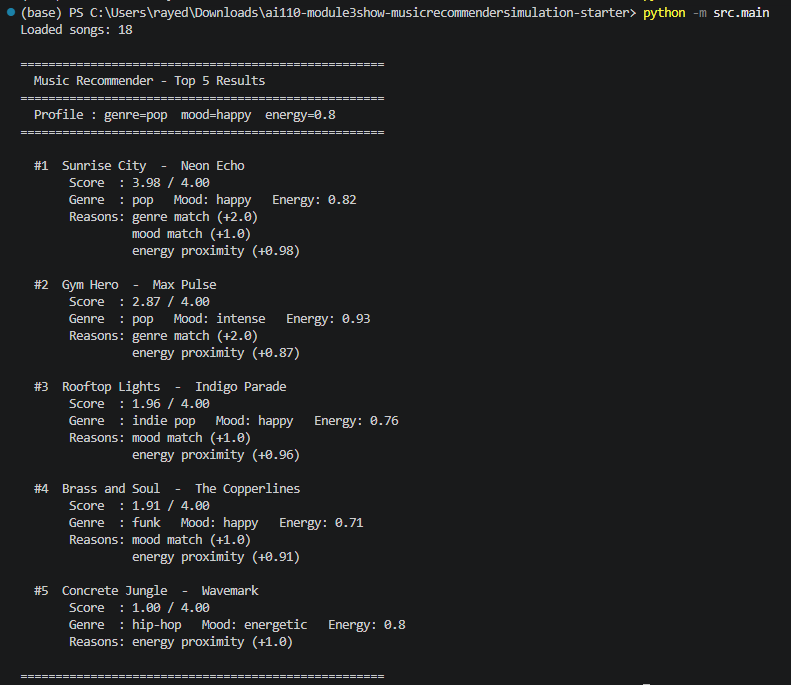
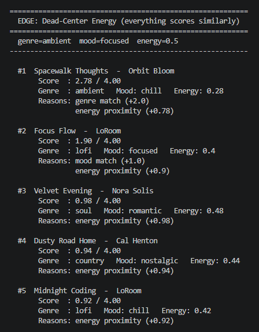

# 🎵 Music Recommender Simulation

## Project Summary

In this project you will build and explain a small music recommender system.

Your goal is to:

- Represent songs and a user "taste profile" as data
- Design a scoring rule that turns that data into recommendations
- Evaluate what your system gets right and wrong
- Reflect on how this mirrors real world AI recommenders

Replace this paragraph with your own summary of what your version does.

---

## How The System Works

Explain your design in plain language.

Some prompts to answer:

- What features does each `Song` use in your system
  - For example: genre, mood, energy, tempo
- What information does your `UserProfile` store
- How does your `Recommender` compute a score for each song
- How do you choose which songs to recommend

You can include a simple diagram or bullet list if helpful.

  Basically how this system is going to work is that it reccomends songs by comparing a user's stated preferences against a catalog of songs utilizing a simple point-based scoring formula. Each song is given a score, all the songs are then ranked highest to lowest and the top results are returned with a short explanmation.
  - +2.0 points if the song's genre matches the user's favorite genre
  - +1.0 point if the song's mood matches the user's preferred mood
  - +0.0 to +1.0 points based on how close the song's energy is to the user's target
  ##### Algorithmic Recepie
  This reccomender works and scores each song by using three rules: +2.0 points for a genre match, +1.0 point for a mood match, and up to +1.0 point based on how close the song's energy is to the user's target. The songs are each ranked then from highest to lowest and then just the top resultys are returned. One bias that might occur and be expected is that genre carries twice the weight of mood, so a great song with the right feel but the wrong genre label will often get buried.

---

## Getting Started

### Setup

1. Create a virtual environment (optional but recommended):

   ```bash
   python -m venv .venv
   source .venv/bin/activate      # Mac or Linux
   .venv\Scripts\activate         # Windows

2. Install dependencies

```bash
pip install -r requirements.txt
```

3. Run the app:

```bash
python -m src.main
```

### Running Tests

Run the starter tests with:

```bash
pytest
```

You can add more tests in `tests/test_recommender.py`.



---

## Experiments You Tried

Use this section to document the experiments you ran. For example:

- What happened when you changed the weight on genre from 2.0 to 0.5
- What happened when you added tempo or valence to the score
- How did your system behave for different types of users

  The two experiments that were run tested the system's sensitivity. Firstly, the genre weight was halved from 2.0 to 1.0 and the energy was doubled from 1.0 to 2.0. This resulted in the top result stayingf the same across most of the rpofiles but positions 3-5 became more and more competative. This is because energy-close songs from unrelated genres were climbing the ranks. The second experiment was where sic user profiles were tested including three adversarial edge cases. This included a user that had conflicting prefrences and a user who only genre had one song in the catalogue. The conflicting profile revealed that genre and mood weights still dominate even when energy is completely mismatched. 

---

## Limitations and Risks

Summarize some limitations of your recommender.

Examples:

- It only works on a tiny catalog
- It does not understand lyrics or language
- It might over favor one genre or mood

You will go deeper on this in your model card.

  The most significant weaknesss that was found during the testing process is that the system silently ignores lthe ikes_acoustic field stored in UserProfile. This is collected from the user but is never used in the scoring function. Acoustic prefrences basically have no effect on the results. This just means that two users with identical genre, mood, and energy prefrences will always receive the exact same recommendations.

---

## Reflection

Read and complete `model_card.md`:

[**Model Card**](model_card.md)

Write 1 to 2 paragraphs here about what you learned:

- about how recommenders turn data into predictions
- about where bias or unfairness could show up in systems like this


---

## 7. `model_card_template.md`

Combines reflection and model card framing from the Module 3 guidance. :contentReference[oaicite:2]{index=2}  

```markdown
# 🎧 Model Card - Music Recommender Simulation

## 1. Model Name

Give your recommender a name, for example:

> VibeFinder 1.0

Model Name: CLaudeVibeMaster

---

## 2. Intended Use

- What is this system trying to do
- Who is it for

  This reccomender basically suggests songs from a very small cataloguebased on a user's stated genre, or mood, or energy prefrerence. It is built for classroom exploration only and is not intended for real users or production use.

---

## 3. How It Works (Short Explanation)

Describe your scoring logic in plain language.

- What features of each song does it consider
- What information about the user does it use
- How does it turn those into a number

Try to avoid code in this section, treat it like an explanation to a non programmer.

  Every song in the catalog is given a score based on how well it matches the user's favorite genre, favorite mood, and target energy level closer matches earn more points. The song with the highest total score ranks first, and each result comes with a plain-English explanation of exactly why it was chosen
    
---

## 4. Data

Describe your dataset.

- How many songs are in `data/songs.csv`
- Did you add or remove any songs
- What kinds of genres or moods are represented
- Whose taste does this data mostly reflect

  The catalog contains 18 songs spanning 15 genres including lofi, pop, rock, jazz, EDM, metal, country, and soul, with 10 mood labels. Eight songs were added to the original starter dataset to improve genre and mood diversity.


---

## 5. Strengths

Where does your recommender work well

You can think about:
- Situations where the top results "felt right"
- Particular user profiles it served well
- Simplicity or transparency benefits

  The system works best when a user has a clear, specific taste for example a lofi/chill listener gets two near-perfect matches at the top every time. Every recommendation also comes with visible reasons, making it easy to understand and trust the output.


---

## 6. Limitations and Bias

Where does your recommender struggle

Some prompts:
- Does it ignore some genres or moods
- Does it treat all users as if they have the same taste shape
- Is it biased toward high energy or one genre by default
- How could this be unfair if used in a real product

  The likes_acoustic preference is collected from the user but never used in scoring, so acoustic taste is completely ignored. Most genres have only one song in the catalog, meaning 13 out of 15 genre groups get one strong match and then four nearly-random results.

---

## 7. Evaluation

How did you check your system

Examples:
- You tried multiple user profiles and wrote down whether the results matched your expectations
- You compared your simulation to what a real app like Spotify or YouTube tends to recommend
- You wrote tests for your scoring logic

You do not need a numeric metric, but if you used one, explain what it measures.

  Six user profiles were tested including three adversarial edge cases a conflicting energy/mood profile, a rare genre, and a dead-center energy profile. The biggest surprise was that the rare-genre user scored 4.00 at position one and below 1.00 at every other position, revealing how much catalog size affects result quality.


---

## 8. Future Work

If you had more time, how would you improve this recommender

Examples:

- Add support for multiple users and "group vibe" recommendations
- Balance diversity of songs instead of always picking the closest match
- Use more features, like tempo ranges or lyric themes

  The most important next step is wiring likes_acoustic into the scoring formula so that preference actually influences results. Adding more songs per genre and introducing a mood-cluster system (so "chill" and "relaxed" are treated as related) would make the recommendations feel much more natural.

---

## 9. Personal Reflection

A few sentences about what you learned:

- What surprised you about how your system behaved
- How did building this change how you think about real music recommenders
- Where do you think human judgment still matters, even if the model seems "smart"

  Working on this project and building this music reccomender with ai-assistanse helped me realized that typical reccomenders are only as good as the data it has on you. The algorithm that was created was pretty accurate but the thin catalogue of songs and data made the results feel more shallow for most of the genre groups. it also changed how I think about Spotify recommendations: what feels like deep personalization is likely backed by millions of data points that smooth over the exact catalog-size problems this simulation exposed.